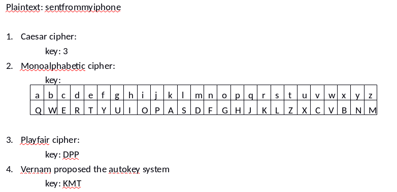
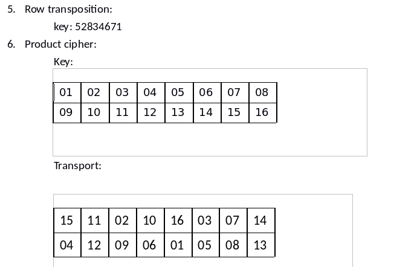
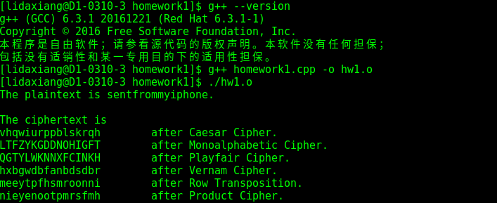

# Introduction of Homework1
> Author : 大祥  
> StartTime: 2017-3-24 ，ModifyTime：2017-06-23

This is the Homework1 of Information Security Course of 2017 Spring Course in NTUST.

## Requirement  
### Main Content
1. Caesar cipher
2. Monoalphabetic cipher
3. Playfair cipher
4. Vernam proposed the autokey system
5. Row transposition
6. Product cipher

### More Details
  
  

## Development Enviroment
Fedora 25  
g++ (GCC) 6.3.1 20161221 (Red Hat 6.3.1-1)
## Excute Result

