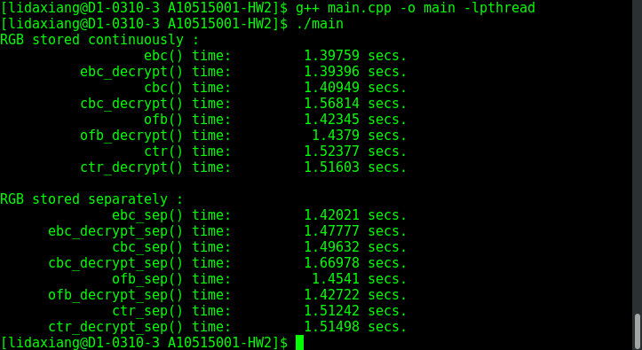

# Homework2 说明
> Author : 大祥  
> StartTime: 2017-05-14 ，ModifyTime：2017-06-23

This is the Homework2 of Information Security Course of 2017 Spring Course in NTUST.

## Requirement
1. Implement DES. (Please don’t call the existing library, implement it by yourself!)

2. **Use your DES as the encryption and decryption (加解密都要) in ECB, CBC, OFB and CTR modes.** Do the cipher on both R.G.B arrays separately and continuously  
(1.將 RGB 分開後，各自加解密; 2.不管 RGB，將讀入的資料連續取 64bit 來加解密).   
Please ignore the header information (標 頭檔不用加解密).   Test your code with the bmp file attached in moodle and save the results(bmp file) of the block cipher modes.  
(That means you have to learn how to read/write bmp file.) In addition, record the execution time of each block cipher modes.
This website may help you with handling bmp files http://olife.iteye.com/blog/1028198

3. Student assistant will test your code with the following parameters:
KEY: 1010101110101011101010111010101110101011101010111010101110101011 (这一长串也就是 **10101011*8** )
IV: 1111101111111011111110111111101111111011111110111111101111111011 (这一长串也就是 **11111011*8** )
and the attached bmp file.

## 实现思路
1. 先实现用 C++ 读取 bmp file 成 RGB 三个数字一组的格式。
2. 对数组进一步处理，因为题目要求加密可以直接对读取结果加密或者把所有点的 R 位置读出来放在一起，之后跟上所有 G 位置以及所有 B 位置的数字。
3. 实现基本的 DES 加密方法。
4. 实现不同模式下的 DES 加密系统，可以加密大量 data。

## 完成功能
1. 完成了所有要求的功能，包括 ECB、CBC、OFB、CTR Model以及两种存储 RGB 的方式，共八个 function 。但continuously 存放的RGB方法在用 ECB 加密后仍无法解密。
2. 输出运行时间的格式做了优化调整。

## 建置環境
Fedora release 25 (Twenty Five)，Linux D1-0310-3.dorm.ntust.edu.tw 4.10.14-200.fc25.x86_64

Programming language 为 C++ ，有使用到 Thread ，系统线程模型是 posix 。编译器是 g++ ，即 g++ (GCC) 6.3.1 20161221 (Red Hat 6.3.1-1)。

## 執行命令与截圖
编译命令是   
```
g++ main.cpp -o main -lpthread
```

执行命令是  
```
./main
```
运行结果截图：


## 其他 code 以及产生的结果說明
测试文件名为 test.bmp，是直接写在每个 function 里面的。

结果文件一般以 Model 名字命名表示加密，modelName_descrption.bmp 表示对应的解密结果。如果后面还有 “_sep” 表示这是在 separately 存放 RGB 的方法下加解密的。

main.cpp 是 program 入口与主程式， read_bmp.h 里面放了读取和写入 .bmp 文件的function。des.encryption.h 放了基本的 DES 变换 function。

而rgb_continuously.h 以及 rgb_separately.h 各自放了作业要求的一种读写 RGB 元素的方法，但里面的加密方式基本相同。
