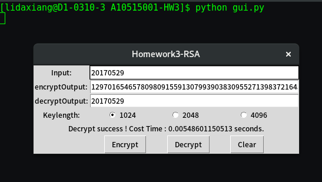

# Homework3 说明
> Author : 大祥  
> StartTime: 2017-05-30 ，ModifyTime：2017-06-23

## Requirement
這次作業要請各位實作出RSA加解密( bit 指的是n的長度)，不限制加密数字或是文字、图片信息。

70分標準:
1. 投影片中提到的找質數方法
2. 1024bit的RSA加解密
3. Square & multiply
4. Chinese remainder theorem

100分標準(每項10分):
1. 可變金鑰長度 1024/2048/4096 bit
2. 大質數產生
3. 可以用 GUI 操作

## 建置環境
Fedora release 25 (Twenty Five)，Linux D1-0310-3.dorm.ntust.edu.tw 4.10.14-200.fc25.x86_64

Programming language 为 **Python** ， 版本是 Python 2.7.13 , gcc 版本是 6.3.1 20161221 (Red Hat 6.3.1-1) (GCC) 。

## 執行命令与截圖
运行 Python 命令是   
```
python gui.py

```

运行结果截图：


## 完成功能
#### 基本功能：
1. 投影片中提到的找質數方法(已完成)
2. 1024bit的 RSA 加解密 (已完成)
3. Square & multiply (已完成)
4. Chinese remainder theorem (已完成)

#### 加分项：
1. 可變金鑰長度 1024/2048/4096 bit (已完成)
2. 大質數產生 (已完成，用投影片里先产生随机数再用 Miller-Rabin Test 检测)
3. GUI (已完成)

## 其他说明
本次作业采用 Python 主要是为了避免大数乘法的复杂性以及为了练习一下 Python。

基于作业没有要求加密明文格式，所以采用了简单的 **加密十进制正整数** 的数字格式，经过测试发现二十位范围的正整数没有问题(更长的没有测，算法上应该也没有问题，这应该回取决于运行机器的 memory)。如果以后要实际加密中英文或其他讯息，只需要把其他类型文字符号转换成对应的正整数就可以了。

#### 三份 code files 的说明：
1. check_probable_prime.py 主要是在运行 Miller-Rabin Test 检测。
2. gui.py 主要是建构窗口程式，并调用 rsa.py 中的函数来加解密。
3. rsa.py 中主要是构建了 RSA 加解密函数，默认的是已经采用了 **small public-key** 方法、加密采用Square-and-Multiply 加速次方乘法、解密函数里默认使用 CRT 中国余数定理加速。
